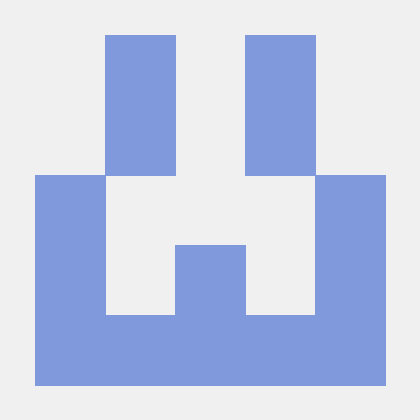

# 코딩테스트 준비/알고리즘 문제풀이 스터디

SW 엔지니어 트랙 2기 - 2차 스터디 (코딩테스트 준비/알고리즘 문제풀이 스터디) 레포지토리입니다.

6명의 레이서(김지환, 박승준, 김호진, 김태준, 조재홍, 임병준)가 참여하는 스터디입니다.

<br />
<br />

## ✅ 참여자

<br />
<table>
  <tr>
    <td align="center">
        <a href="https://github.com/shinbian11" >
            <br />
            <sub>
                <b>김지환</b><br>
            </sub>
        </a>
        <br />
    </td>
    <td align="center">
        <a href="https://github.com/tmdeksdl" >
            <br />
            <sub>
                <b>박승준</b><br>
            </sub>
        </a>
        <br />
    </td>
   <td align="center">
        <a href="https://github.com/hovelopin" >
            <br />
            <sub>
                <b>김호진</b><br>
            </sub>
        </a>
        <br />
    </td>
    <td align="center">
        <a href="https://github.com/MadDawgs" >
            <br />
            <sub>
                <b>김태준</b><br>
            </sub>
        </a>
        <br />
    </td>
    <td align="center">
        <a href="https://github.com/hong1995" >
            <br />
            <sub>
                <b>조재홍</b><br>
            </sub>
        </a>
        <br />
    </td>
    <td align="center">
        <a href="https://github.com/dnjwm8612" >
            <br />
            <sub>
                <b>임병준</b><br>
            </sub>
        </a>
        <br />
    </td>
   </tr>
</table>

<br />
<br />

## ✅ 참여 방법

<br />
1. 이 저장소를 `fork` 한다.
2. 생성된 원격 저장소를 자신의 로컬에 내려받는다.
3. 자신의 `github ID`로 브랜치를 생성한다.
4. 해당 브랜치로 이동하여, 자신의 `github ID`로 폴더를 생성한다.
5. 생성된 폴더에 자신의 소스코드를 업로드 한다. (1파일 1문제)
6. 1문제 해결할때마다 add, commit, push 을 한다 (이때 `commit 메세지 규칙` 을 지키기)
7. 매주 정해진 문제를 모두 해결한 이후, 원본 저장소로 `Pull Request`를 한다. (이때 `Pull Request 규칙` 을 지키기)
8. 다른 사람의 파일을 변경하지 않도록 주의하기!

<br />
<br />

## ✅ 소스코드 생성 규칙

<br />
- 한 문제당 한 파일씩 생성
- 파일명 : BOJ\_문제번호 (확장자는 언어명)

- 예시) C++로 백준 온라인 저지의 10026번 문제 해결했다면

  ```
  BOJ_10026.cpp
  ```

- 한 문제 풀 때마다 커밋하기 (커밋 규칙은 하단 참고!)
- 이번 주차의 문제들을 모두 풀고 나서 한번에 커밋하면 안됨

<br />
<br />

## ✅ commit 메세지 규칙

<br />
- commit 메세지: [BOJ] 문제번호 / 문제명 / 난이도 / 해결한 언어

      - 예시) 터미널에서 작성법

          ```
          git commit -m "[BOJ] 10026 / 적록색약 / 골드 5 / C++"
          ```

  <br />
  <br />

## ✅ Pull Request 규칙

<br />

본인의 repo의 작업한 브랜치 에서, shinbian11 계정 (김지환)의 main 브랜치로 pull request를 보내면 됩니다.

```
head repository 브랜치 : 자신의 local repository
compare : 자신이 작업한 브랜치

base repository 브랜치 : shinbian11/Algorithm_Study_forThreeWeeks
base : main 브랜치
```

### ✅ Pull Request 메세지 규칙

    - PR 제목: 이름 / 주차 (1~3주차) / 이번주에 총 해결한 문제 수

        - 예시) 1주차에 김지환이 10문제를 해결했다면
            - `김지환 / 1주차 / 10문제 `

<br />

## ✅ 코드리뷰 규칙

<br />
- 매주 있는 회의에서 코드리뷰를 한다.

- 전체 코드 흐름을 파악한 뒤, 다른 분의 풀이를 먼저 읽어보면서 하기 내용들을 생각해본다
  - 잘했다고 생각되는 부분
  - 이렇게 수정하면 더 좋을 것 같다고 생각되는 부분
  - 왜 이렇게 풀었는지 이유가 궁금한 부분
  - 또 다른 풀이 방식이나 더 좋은 방법 있으면 제시
